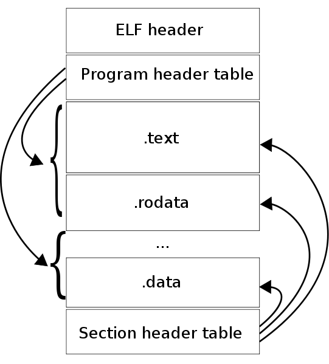

# Анализ бинарных модулей

<!--  -->

Александр Сморкалов (Itseez, ННГУ)
Ноябрь 2013

# Содержание

  1. Мотивация
  1. Исполняемые модули и их форматы
  1. Основные секции исполняемых модулей
  1. Статическая и динамическая компоновка
  1. API, бинарная совместимость
  1. Особенности компиляции C\C++
  1. Анализ зависимостей
  1. Статический анализ
  1. Динамический анализ

# Мотивация. Зачем мне анализ бинарных модулей?

  1. Правильное проектирование ПО
  1. Устранение проблем компоновки
  1. Поддержка библиотек

# Исполняемые модули

Исполняемый модуль - файл, содержащий программу в виде, в котором
она может быть (после загрузки в память и настройки по месту) исполнена
вычислительной машиной.

  1. Аппаратная машина;
  1. Программная машина.

# Аппаратная ВМ

  1. Программа представлена в виде двоичного кода для процессора с конкретной архитектурой;
  1. Программа выполняется на "железном" процессоре;
  1. Исполняемый модуль зависит от ОС и архитектуры ВМ;
  1. Примеры: CPU, GPU, DSP, etc.

# Программная ВМ

  1. Программа может быть представлена в произвольном виде;
  1. Программа выполняется внутри абстрактной виртуальной машины;
  1. Выполняемый модуль не привязан к архитектуре аппаратной машины;
  1. Модуль использует свою модель выполнения, м.б. отличной от аппаратной;
  1. Примеры: JVM, Dalvik, .Net.
  
# Форматы исполняемых модулей

Формат - структура модуля и правила его загрузки (?)

- Windows: COM, NE, PE
- Unix: a.out, COFF, ELF

# COM модуль (CP/M и MS-DOS)

  1. Нет заголовков и метаданных;
  1. Нет явных зависимостей;
  1. Загружается всегда по одному и тому же адресу относительно сегмента;
  1. Файл == сегмент в терминах CPU и RAM;
  1. Максимальный размер 64 KiB;

# ELF модуль (Unix) 1

# ELF модуль (Unix) 2

  1. Заголовок файла:
     - Архитектура аппаратной платформы;
     - Аппаратно зависимые флаги;
     - Точка входа

  1. Таблица заголовков сегментов;
  1. Таблица заголовков секций;
  1. Данные сегментов и секций.

# ELF модуль (Unix) 3

Сегмент - это непрерывная область адресного пространства со своими атрибутами доступа.
В частности, сегмент кода имеет атрибут исполнения, а сегмент данных - атрибуты чтения и записи.
Секция - фрагмент сегмента, имеющий определённое назначение:

  - .init (процедуры инициализации);
  - .plt (секция связок);
  - .text (основой код программы);
  - .fini (процедуры финализации).

Информация о сегментах используется при выполнении (Run-time)
Информация о секциях используются при компоновке (Link-time)
Исполняемые файлы, *.so, *.a, *.o файлы используют ELF формат.

# PE Модуль (Windows) 1

# PE Модуль (Windows) 2

PE = Portable Executable

 1. MS DOS часть для совместимости;
 1. PE заголовок
     - Архитектура аппаратной платформы;
     - Аппаратно зависимые флаги;
     - Подсистема Windows (GUI, CUI, OS/2, Posix);
     - Точка входа;
     - Контрольная сумма;

 1. Заголовки секций;
 1. Данные секций.

# PE Модуль (Windows) 3

 - Исполняемые файлы *.exe, динамические библиотеки *.dll и драйверы используют PE формат;
 - Формат несколько раз расширялся и некоторые функции могут быть реализованы поразному;
 - Не все инструменты одинаково интерпретируют/генерируют PE файлы;
 - В PE  модуле есть отделная секция ресурсов.

# Статическая компоновка (связывание)

  1. Компоновка исполняемого модуля на этапе компиляции;
  1. Все функции находятся внутри выполняемого модуля;
  1. Все адреса переменных и функций определяются на этапе компиляции;
  1. "Нет зависимости" от других библиотек.

# Динамическая компоновка (связывание)

  1. Компоновка исполняемого модуля во время исполнения;
  1. Библиотечные функции находятся в других модулях;
  1. Связывание происходит во время выполнения путём заполнения таблиц адресов;
  1. Явная зависимость от других библиотек.

# Особенности С++

  1. Из классов экспортируются только методы и статические поля
  1. Инлайн методы и шаблонные классы не экспортируются
  1. Декорирование имён
  1. Разные модели обработки исключений
  1. Множественные конструкторы и деструкторы
  1. VTBL
  1. etc

# API

API (Application Programming Interface) - набор готовых классов, процедур, функций, структур и констант,
предоставляемых ОС, приложением, библиотекой для использования во внешних программных продуктах.

  1. Все современные ОС предоставляют API;
  1. Все прикладные приложения явно или косвенно от него зависят;
  1. Необходимо поддерживать совместимость;

# Совместимость API

  1. Бинарная - совместимость на уровне бинарных интерфейсов. Модуль можно заменить другим без потерь.
  1. На уровне исходных кодов. Замена библиотеки на другую не ломает компиляцию и логику программы.

# Бинарная совместимость

  1. Совпадают сигнатуры всех функций и методов;
  1. Совпадает sizeof для всех экспортируемых объектов;
  1. Совпадает состав всех структур, в том числе выравнивание;
  1. Совпадают значения параметров по умолчанию;
  1. Совпадают виртуальные методы;
  1. Совпадает иерархия виртуального наследования;
  1. Могут отличаться имена констант, если они не экспортируются из библиотеки как символ;
  1. Могут отличаться имена и структура макросов;
  1. Могут быть добавлены новые невиртуальные методы;
  1. Могут быть добавлены перегрузки функций, если функция уже была перегружена;
  1. etc

# Бинарная совместимость 2

- Подход проекта KDE: http://techbase.kde.org/Policies/Binary_Compatibility_Issues_With_C++
- Инструмент проверки совместимости: abi-compliance-checker

# Совместимость на уровне исходного кода

  1. Может отличаться число параметров функции, если определены значения по умолчанию для новых параметров;
  1. Могут быть добавлены перегрузки методов;
  1. Могут отличаться виртуальные методы;
  1. Могут отличаться sizeof, выравнивание и поля структур;
  1. Совпадают имена всех констант и макросов;
  1. etc

# Статический анализ

Анализ без запуска модуля на выполнение

  1. Анализ таблиц импорта и экспорта
  1. Дизасемблирование

# Linux

  1. readelf, ar, c++filt
  1. objdump, gdb

# Windows

  1. Dependency Walker
  1. Olly DBG, IDA Pro, HEIW, etc

# Динамический анализ

  1. Отладка
  1. Профилировка производительности
  1. Профилировка системных вызовов
  1. Профилировка работы с памятью
  1. etc

#Linux

  1. gdb
  1. gprof, oprofile
  1. strace
  1. valgrind

# Windows

  1. MS WinDBG, Olly DBG, VisualStudio
  1. VTune, Parallel Studio, etc
  1. Sysinternals tools: Filemon, Regmon, DebugView

# Инструменты

  1. Dependency Walker: http://www.dependencywalker.com/
  1. Filemon: http://technet.microsoft.com/en-us/sysinternals/bb896642.aspx
  1. Regmon: http://technet.microsoft.com/en-us/sysinternals/bb896652.aspx
  1. DebugView: http://technet.microsoft.com/en-us/sysinternals/bb896647.aspx
  1. abi-compliance-checker http://ispras.linuxbase.org/index.php/ABI_compliance_checker